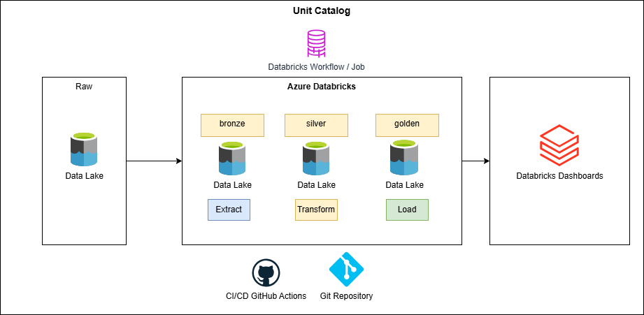
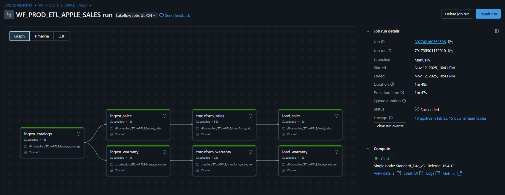

<div align="center">

# 🍏 Apple Store Sales and Warranty ETL Pipeline
### Arquitectura Medallion en Azure Databricks

[](https://databricks.com/)
[](https://azure.microsoft.com/)
[](https://spark.apache.org/)
[](https://delta.io/)
[](https://powerbi.microsoft.com/)
[](https://github.com/features/actions)

*Pipeline automatizado de datos para análisis de ventas y garantias de Apple Stores con arquitectura de tres capas y despliegue continuo*

</div>

---

## 🎯 Descripción

Pipeline ETL enterprise-grade que transforma datos crudos de ventas y garantias de tiendas Apple de diferentes años y paises, implementando la **Arquitectura Medallion** (Bronze-Silver-Gold) en Azure Databricks con **CI/CD completo** y **Delta Lake** para garantizar consistencia ACID.

### ✨ Características Principales

- 🔄 **ETL Automatizado** - Pipeline completo con despliegue automático via GitHub Actions
- 🏗️ **Arquitectura Medallion** - Separación clara de capas Bronze → Silver → Gold
- 📊 **Modelo Dimensional** - Star Schema optimizado para análisis de negocio
- 🚀 **CI/CD Integrado** - Deploy automático en cada push a master
- 📈 **Power BI Ready** - Conexión directa con SQL Warehouse
- ⚡ **Delta Lake** - ACID transactions y time travel capabilities
- 🔔 **Monitoreo** - Notificaciones automáticas y logs detallados

---

## 🏛️ Arquitectura

### Flujo de Datos

```
📄 CSV (Raw Data)
    ↓
🥉 Bronze Layer (Ingesta sin transformación)
    ↓
🥈 Silver Layer (Limpieza + Modelo Dimensional)
    ↓
🥇 Gold Layer (Agregaciones de Negocio)
    ↓
📊 Power BI (Visualización)
```




### 📦 Capas del Pipeline

<table>
<tr>
<td width="33%" valign="top">

#### 🥉 Bronze Layer
**Propósito**: Zona de aterrizaje

**Tablas**: 
- `category` 
- `products` 
- `warranty`
- `sales` 
- `stores`

**Características**:
- ✅ Datos tal como vienen de origen
- ✅ Timestamp de ingesta
- ✅ Preservación histórica
- ✅ Sin validaciones

</td>
<td width="33%" valign="top">

#### 🥈 Silver Layer
**Propósito**: Modelo dimensional

**Tablas**:
- `category_sales`
- `product_sales`
- `store_sales`
- `store_warranty_status`
- `waranty_products`

**Características**:
- ✅ Star Schema
- ✅ Datos normalizados
- ✅ Validaciones completas

</td>
<td width="33%" valign="top">

#### 🥇 Gold Layer
**Propósito**: Analytics-ready

**Tablas**:
- kpi_category_sales        : Monto total en ventas agrupado por categoría y año
- kpi_product_sales         : Monto total en ventas agrupado por producto y año
- kpi_store_sales           : Monto total en ventas agrupado por tienda y año
- kpi_store_warranty_status : Total de reclamos por tienda en los diferentes estatus pivot
- kpi_product_warranty      : Productos con mayor reclamos post venta (garantía)

**Características**:
- ✅ Pre-agregados
- ✅ Optimizado para BI
- ✅ Performance máximo
- ✅ Actualizaciones automáticas

</td>
</tr>
</table>

---

## 📁 Estructura del Proyecto

```
etl-apple/
│
├── 📂 .github/
│   └── 📂 workflows/
│       └── 📄 deploy-certification.yml    # Pipeline CI/CD deploy a certification workspace databricks
├── 📂 process/
│   ├── 🐍 ingest_catalogs.py           # Bronze layer
│   ├── 🐍 ingest_sales.py              # Bronze Layer
│   ├── 🐍 ingest_warranty.py           # Bronze Layer
│   ├── 🐍 transform_sales.py           # Silver Layer
│   ├── 🐍 transform_warranty.py        # Silver Layer
│   └── 🐍 load_sales.py                # Gold Layer
│   └── 🐍 load_warranty.py             # Gold Layer
├── 📂 security/
|   ├── 🐍 Enviroment preparation.py    # Create Schema, Tables, External location
├── 📂 security/
|   ├── 🐍 Permissions.py               # Sql Grant
└── 📄 README.md
```

---

## 🛠️ Tecnologías

<div align="center">

| Tecnología | Propósito |
|:----------:|:----------|
|  | Motor de procesamiento distribuido Spark |
|  | Storage layer con ACID transactions |
|  | Framework de transformación de datos |
|  | Data Lake para almacenamiento persistente |
|  | Automatización CI/CD |
|  | Business Intelligence y visualización |

</div>

---

## ⚙️ Requisitos Previos

- ☁️ Cuenta de Azure con acceso a Databricks
- 💻 Workspace de Databricks configurado
- 🖥️ Cluster activo (nombre: `Cluster1`)
- 🐙 Cuenta de GitHub con permisos de administrador
- 📦 Azure Data Lake Storage Gen2 configurado
- 📊 Power BI Desktop (opcional para visualización)

---

## 🚀 Instalación y Configuración

### 1️⃣ Clonar el Repositorio

```bash
git clone https://github.com/guaru/project-databricks.git
cd project-databricks
```

### 2️⃣ Configurar Databricks Token

1. Ir a Databricks Workspace
2. **User Settings** → **Developer** → **Access Tokens**
3. Click en **Generate New Token**
4. Configurar:
   - **Comment**: `GitHub CI/CD`
   - **Lifetime**: `90 days`
5. ⚠️ Copiar y guardar el token

### 3️⃣ Configurar GitHub Secrets

En tu repositorio: **Settings** → **Secrets and variables** → **Actions**

| Secret Name | Valor Ejemplo |
|------------|---------------|
| `DATABRICKS_HOST` | `https://adb-xxxxx.azuredatabricks.net` |
| `DATABRICKS_TOKEN` | `dapi_xxxxxxxxxxxxxxxx` |

### 4️⃣ Verificar Storage Configuration

```python
storage_path = "abfss://raw@adlsprojectsmartdata.dfs.core.windows.net"
```

<div align="center">

✅ **¡Configuración completa!**

</div>

---

## 💻 Uso

### 🔄 Despliegue Automático (Recomendado)

```bash
git add .
git commit -m "✨ feat: mejoras en pipeline"
git push origin master
```

**GitHub Actions ejecutará**:
- 📤 Deploy de notebooks a `/Production/ETL-APPLE`
- 🔧 Creación del workflow `WF_PROD_ETL_APPLE_SALES`
- ▶️ Ejecución completa:  Bronze → Silver → Gold
- 📧 Notificaciones de resultados

### 🖱️ Despliegue Manual desde GitHub

1. Ir al tab **Actions** en GitHub
2. Seleccionar **Deploy ETL Apple Sales And Warranty**
3. Click en **Run workflow**
4. Seleccionar rama `main`
5. Click en **Run workflow**

### 🔧 Ejecución Local en Databricks

Navegar a `/Production/ETL-APPLE` y ejecutar en orden:

```
- Enviroment preparation.py         → Crear esquema
- ingest_catalogs.py                → Bronze Layer
- ingest_sales.py                   → Bronze Layer
- ingest_warranty.py                → Bronze Layer
- transform_sales.py                → Silver Layer
- transform_warranty.py             → Silver Layer
- load_sales.py                     → Gold Layer
- load_warranty.py                  → Gold Layer
```

---


## 🔄 CI/CD

### Pipeline de GitHub Actions

```yaml
Workflow: Deploy ETL Apple Sales And Warranty
├── Deploy notebooks → /Production/ETL-APPLE
├── Eliminar workflow antiguo (si existe)
├── Buscar cluster configurado
├── Crear nuevo workflow con 4 tareas
├── Ejecutar pipeline automáticamente
└── Monitorear y notificar resultados
```

### 🔄  Workflow Databricks

```


⏰ Schedule: Diario 8:00 AM (Lima)
⏱️ Timeout total: 4 horas
 🔒 Max concurrent runs: 1
⏰ Notificaciones: 
      success: isc.ventura@gmail.com
      failed:  isc.ventura@gmail.com
```

---

## 📈 Dashboards
### Apple Sales
### Apple Warranty


## 🔍 Monitoreo

### En Databricks

**Workflows**:
- Ir a **Workflows** en el menú lateral
- Buscar `ETL_PROD_APPLE_SALES`
- Ver historial de ejecuciones

**Logs por Tarea**:
- Click en una ejecución específica
- Click en cada tarea para ver logs detallados
- Revisar stdout/stderr en caso de errores

### En GitHub Actions

- Tab **Actions** del repositorio
- Ver historial de workflows
- Click en ejecución específica para detalles
- Revisar logs de cada step

---

## 👤 Autor

<div align="center">

### Alejandro de Jesus Ventura Martinez

[](https://www.linkedin.com/in/alejandro-ventura-martinez-049009142/)
[](https://github.com/guaru)
[](mailto:isc.ventura@gmail.com)

**Data Engineering** | **Azure Databricks** | **Delta Lake** | **CI/CD**

</div>

---

## 📄 Licencia

Este proyecto está bajo la Licencia MIT - ver el archivo [LICENSE](LICENSE) para más detalles.

---

<div align="center">

**Proyecto**: Data Engineering - Arquitectura Medallion  
**Tecnología**: Azure Databricks + Delta Lake + CI/CD  
**Última actualización**: 2025


</div>